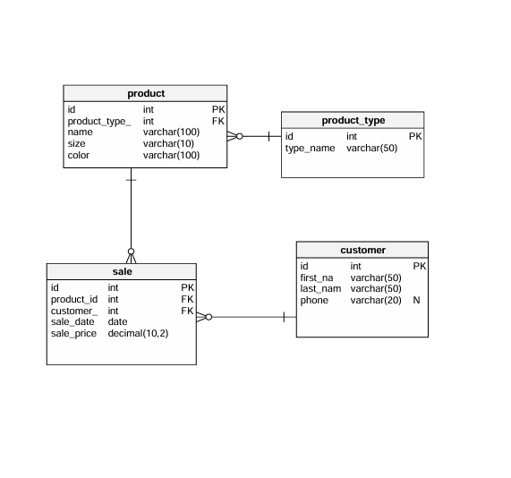

# Clothing Store

A simple Spring Boot + HSQLDB application that simulates a small clothing store’s inventory management.  
You can browse product types, add new products, update existing records—all against an in-memory HyperSQL database.

---

## Table of Contents

1. [Description](#description)
2. [Prerequisites](#prerequisites)
3. [Getting Started](#getting-started)
    - [Clone the repository](#clone-the-repository)
    - [Build & Run (IntelliJ IDEA)](#build--run-intellij-idea)
4. [Swagger UI](#swagger-ui)
5. [Configuration](#configuration)
6. [Database Initialization](#database-initialization)
7. [Database Structure](#database-structure)
8. [Available Endpoints](#available-endpoints)

---

## Description

This example implements basic CRUD operations for a **Clothing Store**:

- **MVP**
    - Find a product by ID
    - List of all products
    - Add a product
    - Update a product
    - Delete a product

---

## Prerequisites

- Java 21
- Gradle (or use the included `gradlew`)
- IntelliJ IDEA (optional, but recommended)

---

## Getting Started

---

### Clone the repository

Via IntelliJ IDEA

1. Open IntelliJ IDEA.
2. From the Welcome screen (or File menu), choose **Get from Version Control…**
3. In the dialog that appears, paste `https://github.com/AdrianKoitla/myproject.git` into the **URL** field.
4. Select your desired local directory and click **Clone**.
5. Once the clone completes, IntelliJ will open the project—allow it to import/reload the Gradle settings.

Via command line
```bash
git clone https://github.com/AdrianKoitla/myproject.git
```

---

### Build & Run (IntelliJ IDEA)

1. **Open the project**
    - In IntelliJ IDEA, select **File ▸ Open…** and choose the project’s root folder (containing `build.gradle`).
    - IntelliJ will automatically reload the Gradle project. If you encounter any issues, click the “Refresh” icon in the Gradle tool window to force a manual reload.

2. **Run the application**
    - In the **Project** tool window, navigate to `src/main/java/eu/itcrafters/myproject/MyprojectApplication.java`.
    - Click the green ▶︎ icon next to the `main` method, or right-click the file and choose **Run 'MyprojectApplication'**.

3. **Verify startup**
    - The console should show Spring Boot starting on port 8080.
    - Open your browser to Swagger UI page `http://localhost:8080/swagger-ui/index.html` to confirm the server is running.

4. **Stop the server**
    - Click the red ■ icon in the Run tool window, or press **Ctrl + F2** (Windows/Linux) or **⌘ + F2** (macOS).

---

## Swagger UI

After startup, you can browse your OpenAPI docs at: `http://localhost:8080/swagger-ui/index.html`

---
## Configuration

All runtime settings live in `src/main/resources/application.properties`.

---

## Database Initialization

On startup, Spring Boot will automatically run any `schema.sql` and `data.sql` files found on the classpath (i.e. in `src/main/resources`) to build and seed your HSQLDB schema.

### schema.sql

- Defines your tables, constraints, indexes, etc.

### data.sql

- Populates your newly created tables with initial or sample data.
- Executed immediately after `schema.sql`, so all referenced tables already exist.
- Use it to insert lookup values, demo rows, or any seed data your application needs on startup.

---

## Database Structure


---

## Available Endpoints

### Product Endpoints

| Method | Path                   | Description                          |
| ------ |------------------------|--------------------------------------|
| GET    | `/product/{productId}` | Retrieve a single product by its ID  |
| GET    | `/products`            | List all products in the store       |
| POST   | `/product`             | Create a new product record          |
| PUT    | `/product/{productId}` | Update an existing product’s details |
| DELETE | `/product/{productId}` | Delete a product by its ID           |

### Customer Endpoints

| Method | Path                    | Description                           |
| ------ |-------------------------|---------------------------------------|
| GET    | `/customers`            | List all customers                    |
| GET    | `/customers/{id}`       | Retrieve a single customer by its ID  |
| POST   | `/customers`            | Create a new customer record          |
| PUT    | `/customers/{id}`       | Update an existing customer's details |
| DELETE | `/customers/{id}`       | Delete a customer by its ID           |

### Sale Endpoints

| Method | Path                    | Description                           |
| ------ |-------------------------|---------------------------------------|
| GET    | `/sales`                | List all sales                        |
| POST   | `/sales`                | Create a new sale record              |

---
